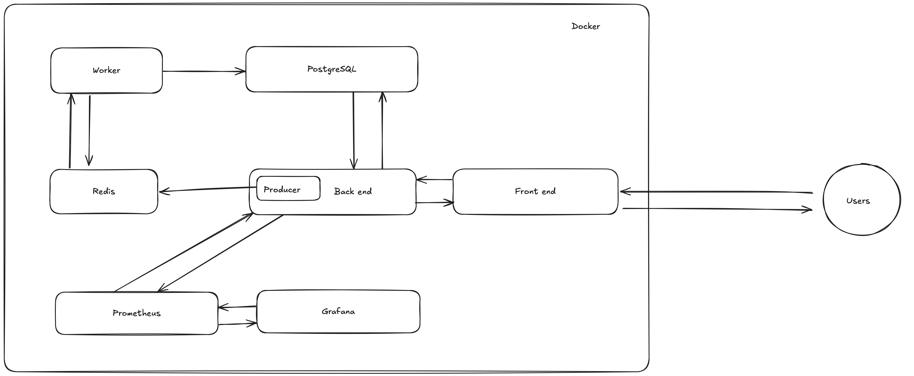

# Desafio SRE Globo API

Este projeto é um desafio de SRE, com o objetivo de implementar uma solução capaz de suportar votações em tempo real, garantindo alta disponibilidade, escalabilidade, segurança e performance.

## Tecnologias Utilizadas
- **Node.js** (Runtime JavaScript assíncrono e baseado em eventos, executado no V8, usado para construir aplicações escaláveis no lado do servidor.)
- **PostgreSQL** (Banco de dados relacional para persistência de dados.)
- **Prisma** (ORM utilizado para interação com o banco de dados)
- **Redis** (Utilizado para filas de processamento assíncrono)
- **Grafana** (Utilizado para monitoramento e visualização de métricas)
- **Docker & Docker Compose** (Containerização da aplicação para facilitar o deploy e a escalabilidade)
- **Prometheus** (Ferramenta de monitoramento e coleta de métricas em tempo real)

---

## Como Rodar a Aplicação

### Opção 1: Executando via Docker (Recomendado)

### **Pré-requisitos**
- [Docker](https://www.docker.com/) instalado
- [Docker Compose](https://docs.docker.com/compose/install/) instalado
- [Node.Js](https://nodejs.org/en) instalado
- [Prisma CLI](https://www.prisma.io/docs/orm/tools/prisma-cli) instalado globalmente

### **Passos**
1. Clone o repositório:
   ```sh
   git clone git@github.com:mtheusbrito/challenge-sre-globo-api.git
   cd challenge-sre-globo-api
   ```

2. Crie um arquivo `.env` com as seguintes variáveis:
   ```env
   NODE_ENV=development

   POSTGRES_HOST=localhost
   POSTGRES_USER=informe-um-usuario-para-o-postrgres
   POSTGRES_PASSWORD=informe-uma-senha-para-o-postrgres
   POSTGRES_DB=informe-um-nome-para-o-banco

   REDIS_HOST=127.0.0.1
   REDIS_PORT=6379

   HTTP_SERVER_PORT=3001
   WORKER_SERVER_PORT=3004


   DATABASE_URL="postgresql://${POSTGRES_USER}:${POSTGRES_PASSWORD}@${POSTGRES_HOST}:5432/${POSTGRES_DB}?schema=public"

   JWT_SECRET=informe-um-secret(pode ser uma palavra encriptada em md5)
   ```

3. Suba os containers:
   ```sh
   docker-compose up -d
   ```

4. Verifique se os containers estão rodando corretamente:
   ```sh
   docker ps
   ```

5. Execute as migrations:
   ```sh
   npm run db:migrate
   ```

6. Popule o banco:
   ```sh
   npm run db:seed
   ```

7. Acesse a documentaçao da aplicação no navegador:
   ```sh
   http://localhost:3001/api/docs#/
   ```

8. Acesse as Metricas da aplicaçao no navegador:
   ```sh
   http://localhost:3001/metrics
   ```   

9. Acesse as Métricas do worker no navegador:
   ```sh
   http://localhost:3004/metrics
   ```  

9. Acesse o Prometheus no navegador:
    ```sh
    http://localhost:9090
    ```

10. Acesse o Grafana no navegador:
    ```sh
    http://localhost:3002
    ```

8. Para parar os containers:
   ```sh
   docker-compose down
   ```
---

### Opção 2: Executando Localmente (Sem Docker)

### **Pré-requisitos**
- [PostgreSQL](https://www.postgresql.org/) instalado e rodando
- [Redis](https://redis.io/) instalado e rodando
- [Node.Js](https://nodejs.org/en) instalado
- [Prisma CLI](https://www.prisma.io/docs/orm/tools/prisma-cli) instalado globalmente

### **Passos**
1. Clone o repositório:
   ```sh
   git clone git@github.com:mtheusbrito/challenge-sre-globo-api.git
   cd challenge-sre-globo-api
   ```

2. Instale as dependências:
   ```sh
   npm install
   ```

3. Crie um arquivo `.env` com as seguintes variáveis:
   ```env
   NODE_ENV=development

   POSTGRES_HOST=localhost
   POSTGRES_USER=informe-um-usuario-para-o-postrgres
   POSTGRES_PASSWORD=informe-uma-senha-para-o-postrgres
   POSTGRES_DB=informe-um-nome-para-o-banco

   REDIS_HOST=127.0.0.1
   REDIS_PORT=6379

   HTTP_SERVER_PORT=3001
   WORKER_SERVER_PORT=3004

   DATABASE_URL="postgresql://${POSTGRES_USER}:${POSTGRES_PASSWORD}@${POSTGRES_HOST}:5432/${POSTGRES_DB}?schema=public"

   JWT_SECRET=informe-um-secret(pode ser uma palavra encriptada em md5)
   
   ```

4. Gere o client do prisma:
    ```sh
    npm run db:generate
    ```

5. Execute as migrations:
    ```sh
    npm run db:migrate
    ```

6. Popule o banco:
   ```
   npm run db:seed
   ```

5. Inicie a aplicação:
   ```sh
   npm run dev
   ```

6. Acesse a documentacao da aplicação no navegador:
   ```sh
   http://localhost:3001/api/docs
   ```


## Criação de Dados no Banco Após Seed

Após rodar o seed, dois usuários são criados no banco de dados. 

Usuário admin
email: admin@email.com
senha: password

Usuário comum
email: user@email.com
senha: password

Também são criados dados de paredões e participantes.


## Solução de Problemas

### Prisma - binaryTargets

Ao executar comandos como `npm run db:generate` ou `npm run db:migrate` você pode receber um aviso informando que a plataforma atual (`darwin-arm64` no exemplo fornecido abaixo) não está incluída na configuração binaryTargets do seu gerador no arquivo prisma/schema.prisma. Isso impede que o Prisma Client gere os binários corretos para sua plataforma, o que pode levar a erros de execução.
 
   ```sh
   Warning: Your current platform `darwin-arm64` is not included in your generator's `binaryTargets` configuration ["linux-musl-arm64-openssl-3.0.x"].
   To fix it, use this generator config in your schema.prisma:
   generator client {
      provider      = "prisma-client-js"
      binaryTargets = ["native", "linux-musl-arm64-openssl-3.0.x"]
   }
   Note, that by providing `native`, Prisma Client automatically resolves `darwin-arm64`.
   Read more about deploying Prisma Client: https://www.prisma.io/docs/reference/tools-and-interfaces/prisma-schema/generators
   ```
   Solução: 
   Localize o arquivo `schema.prisma` no diretório `prisma`, localizado na raiz do projeto.

   Dentro do bloco `generator client`, adicione ou modifique a propriedade binaryTargets para incluir a plataforma que ele solicita.

   Seguindo o exemplo acima, após aplicar o ajuste ficaria assim: 

   ```sh
   generator client {
      provider      = "prisma-client-js"
      binaryTargets = ["linux-musl-arm64-openssl-3.0.x", "darwin-arm64"]
      output        = "../.prisma/client"
   }
   ```
   Execute o comando novamente.

   ## Arquitetura atual da solução

   

